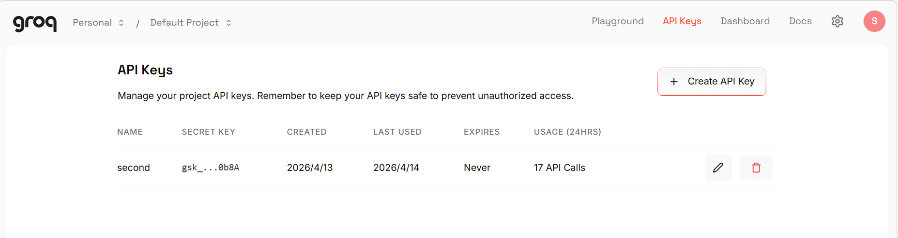
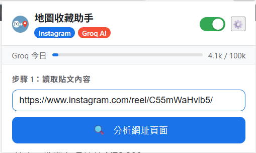
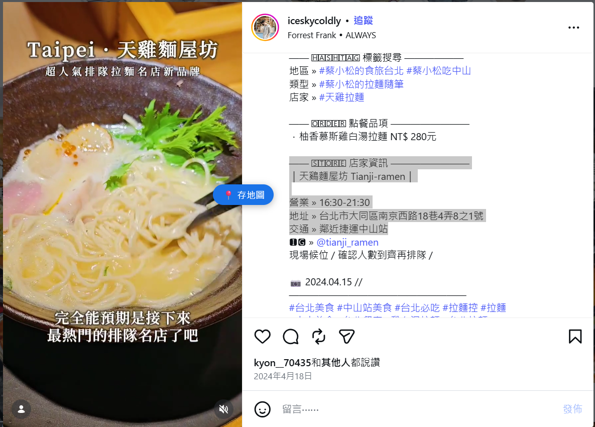

# 地圖收藏助手 Map Saver

一個 Chrome 擴充功能，從 Instagram、Facebook、YouTube 等社群媒體貼文中自動抽取店家名稱，並一鍵存入 Google Maps 收藏清單。

---

## 功能

- **自動抽取店名**：用 Groq AI 分析貼文，辨識餐廳、咖啡廳、景點等地點
- **浮動快速按鈕**：在任意網頁反白文字，即可直接觸發分析（可開關）
- **自動存入 Google Maps**：搜尋地點並加入指定收藏清單，全程自動化
- **分店消歧義**：抽取貼文中的地區資訊（如「六本木」「信義區」），搜尋時自動附加避免找錯分店
- **用量顯示**：即時顯示每日 token 用量進度條（上限 100k）

## 支援平台

Instagram、Facebook、YouTube、TikTok、Twitter / X、Threads，以及任意網頁（貼上 URL 或反白文字）

---

## 安裝方式

1. 下載或 clone 此 repo
2. 開啟 Chrome，前往 `chrome://extensions/`
3. 右上角開啟「開發人員模式」
4. 點擊「載入未封裝項目」，選擇此資料夾
5. 點擊工具列圖示，前往 ⚙️ 設定頁面輸入 Groq API Key

---

## 取得 Groq API Key（免費）

1. 前往 [console.groq.com](https://console.groq.com)（不需信用卡）
2. 註冊帳號 → 建立 API Key
3. 貼到擴充功能設定頁面



免費額度：每日 **100,000 tokens**，每次分析約消耗 1,500–2,500 tokens（一天可分析約 40–60 次）

---

## 使用方式

### 方法一：分析當前頁面
1. 前往社群媒體貼文頁面
2. 點擊擴充功能圖示
3. 點擊「分析網址頁面」
4. 確認找到的地點，輸入 Google Maps 清單名稱
5. 點擊「儲存到 Google Maps」



### 方法二：反白文字快速分析
1. 在任意網頁反白包含店名的文字
2. 點擊左側出現的「📍 存地圖」浮動按鈕
3. 擴充功能自動開啟並分析



### 方法三：貼上連結
1. 開啟擴充功能
2. 在網址欄貼上貼文連結
3. 點擊「分析網址頁面」

---

## 檔案結構

```
├── manifest.json          # 擴充功能設定
├── background.js          # Service Worker：Groq AI 呼叫、Google Maps 自動化
├── popup.html / js / css  # 主要操作介面
├── options.html / js      # 設定頁面（Groq API Key）
├── content_extractor.js   # 注入各平台頁面，擷取貼文文字
├── selection_trigger.js   # 注入所有頁面，偵測反白文字顯示浮動按鈕
├── maps_automator.js      # 注入 Google Maps，自動點擊儲存
└── icons/                 # 擴充功能圖示
```

---

## 注意事項

- 儲存地點時會短暫開啟 Google Maps 分頁（Google Maps 沒有提供 API，自動操作完成後自動關閉）
- 需要已登入 Google 帳號才能使用 Maps 收藏功能
- Groq 免費方案每日上限 100,000 tokens，隔天自動重置
